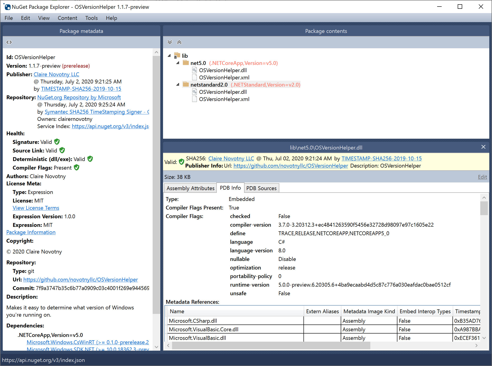
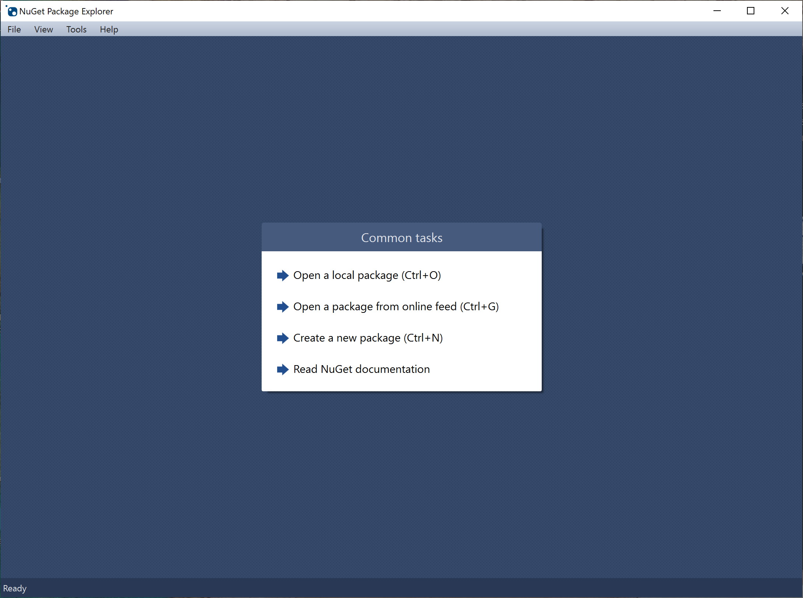
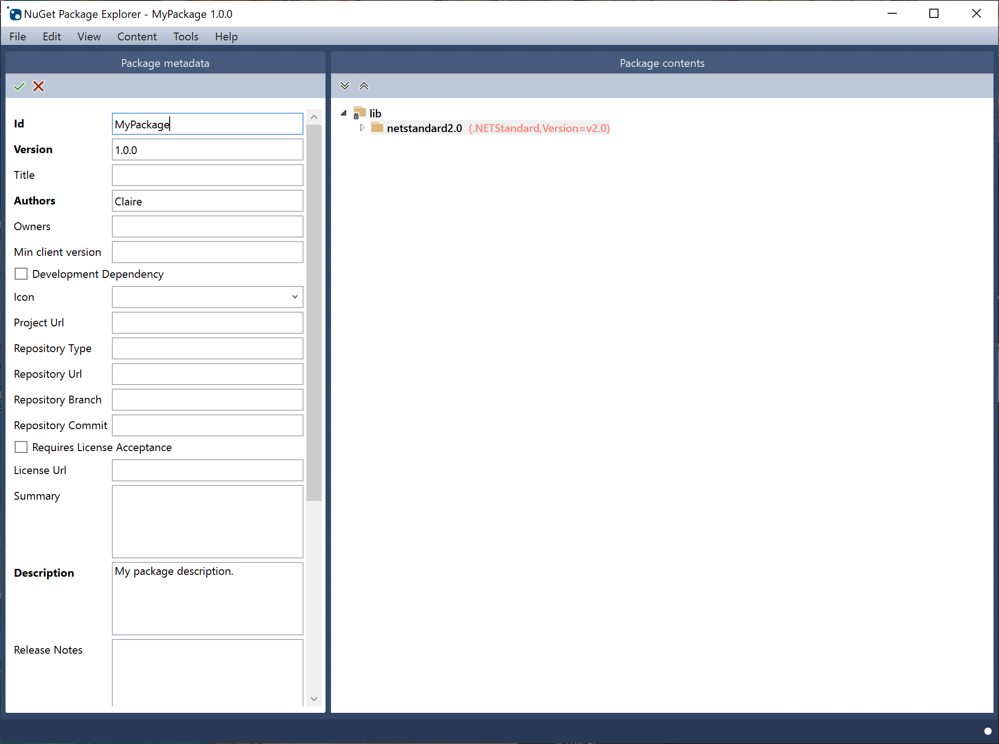
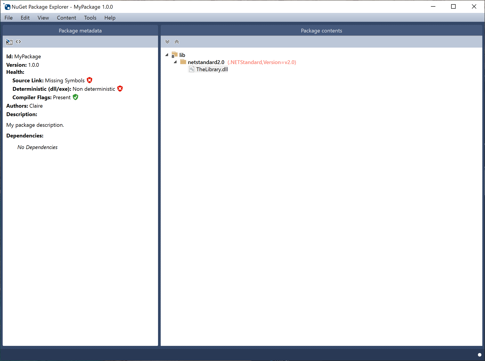
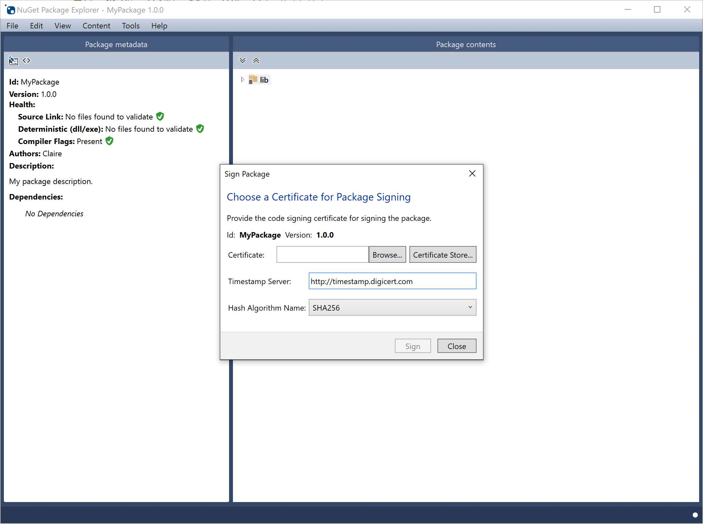
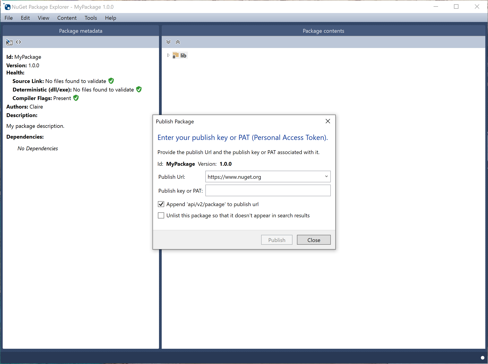

## How to install

You could install with the [Microsoft Store](https://www.microsoft.com/store/apps/9wzdncrdmdm3) or [Chocolatey](https://chocolatey.org/packages/NugetPackageExplorer). The Microsoft Store is the preferred version for Windows 10 Creators Update and later. It auto-updates and is the full application.

There also a CI build available for direct install on Windows 10 1803 and higher. The nightly build installs alongside
the release version with no interference and will automatically update.

| Build Number | Link |
| ------------ | ---- |
| | [Install](https://nugetpackageexplorer.blob.core.windows.net/nightly/install.html)
|  | [Microsoft Store](https://www.microsoft.com/store/apps/9wzdncrdmdm3) |
|  | [Chocolatey](https://chocolatey.org/packages/NugetPackageExplorer) |

### Microsoft Store (recommended)

### Chocolatey

Chocolatey is another great way to install and update your application.

1. Run PowerShell (as Admin)
2. Install Chocolatey: `iwr https://chocolatey.org/install.ps1 -UseBasicParsing | iex`
3. Install NuGet Package Explorer: `choco install nugetpackageexplorer`

## What is NuGet Package Explorer?

NuGet Package Explorer (NPE) is an application that makes it easy to create and explore NuGet packages. You can load a .nupkg or .snupkg file from disk or directly from a feed such as [nuget.org](https://www.nuget.org/).

To build packages from the command line, use NuGet command-line tools, as documented on the [official NuGet site](https://docs.nuget.org/ndocs/create-packages/creating-a-package).

## Contributing

We accept pull requests (PR). Please open an issue to discuss first if there isn't a related issue yet.

If you'd like to help, please check the GitHub [issues](https://github.com/NuGetPackageExplorer/NuGetPackageExplorer/issues). If you'd like to contribute more structurally, we would be happy to add you to our team!

## Issues

Please check the [FAQ](https://github.com/NuGetPackageExplorer/NuGetPackageExplorer/wiki) first and search for duplicate issues before reporting them. 

## Creating a Package

1. Launch NPE and select **File > New** (Ctrl-N), or select **Create a new package** from the **Common tasks** dialog when Package Explorer starts:

	

2. Select **Edit > Edit Package Metadata** (Ctrl-K) to open the editor for the underlying .nuspec file. Details for the metadata can be found in the [nuspec reference](https://docs.nuget.org/ndocs/schema/nuspec).

	

3. Open the files you want to include in the package in Windows explorer, then drag them into the **Package contents** pane of Package Explorer. Package Explorer will attempt to infer where the content belongs and prompt you to place it in the correct directory within the package. (You can also explicitly add specific folders using the **Content** menu.)

	For example, if you drag an assembly into the Package contents window, it will prompt you to place the assembly in the **lib** folder:

	

	

4. Save your package with **File > Save** (Ctrl-S).
5. If you have a code signing certificate, sign your package with **File > Sign and Save As**.
 
	

## Publishing a Package

1. Create a free account on [nuget.org](http://nuget.org/), or log in if you already have one. When creating a new account, you'll receive a confirmation email. You must confirm the account before you can upload a package.

2. Once logged in, click your username (on the upper right) to navigate to your account settings.

3. Under **API Key**, click **copy to clipboard** to retrieve the API key you'll need in the next step.

      

4. Assuming your package is loaded in Package Explorer, select **File > Publish** (Ctrl-P) to bring up the **Publish Package** dialog.

	

5. Paste your API key into **Publish key** and click **Publish** to push the package to nuget.org.

6. In your profile on nuget.org, click **Manage my Packages** to see the one that you just published; you'll also receive a confirmation email. Note that it might take a while for your package to be indexed and appear in search results, during which time you'll see a message that the package hasn't yet been indexed.

## Build

Requirements to build the project:

- VS2019 or later. If using the stable release, make sure to enable support for Preview .NET Core SDK's
- [Windows 10 SDK 17134](https://developer.microsoft.com/en-US/windows/downloads/windows-10-sdk)
- [.NET Core 3 SDK](https://github.com/dotnet/core-sdk)

## Diagnostics

Thank you to [Bugsnag](https://www.bugsnag.com/) for their generous [license for Open Source projects](https://www.bugsnag.com/open-source/)!